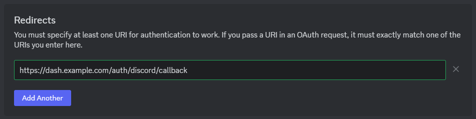

# Configure Discord for DezerX

***

This guide will show you how to link a Discord auth application to DezerX, which allows
users to authenticate with DezerX via their Discord account.

***

### Configure a Discord application

Firstly, you'll need to make a Discord App in order to obtain a Client ID and Client Secret.
You can do this by heading to the [Discord Developer Portal](https://discord.com/developers)
and clicking the 'New Application' button. Give it a name of your choice (this WILL be visible to
clients), and hit 'Create'.

### Obtain the Client ID and Secret

Next, we'll need to grab two things: our app's ID and also its Secret in order to keep the app secure.

### Configure Redirect URLs

You will now need to configure Redirects so Discord knows where to point your users after authentication.
You can do this by clicking the 'Add Redirect' button and adding these two URLs.

### Add Client ID and Secret to DezerX

Finally, open ur code editor or terminal, go in ``.env`` and change these:

### Test your Application

Give it a whirl and try to log in via Discord. If you encounter an error like `invalid_redirect_uri`, go over
step 3 again and make sure your settings are 100% correct and valid.

?>
Congrats! DezerX Discord Oauth should be functioning normally.
If you encounter any issues, please let us know on our [Discord](https://discord.gg/UN4VVc2hWJ).